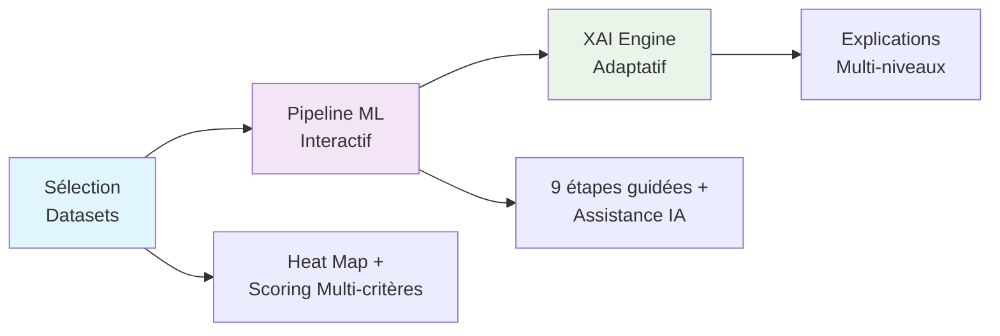

# IBIS X - Pipeline Intégré pour la Démocratisation du Machine Learning

Status: Coming Soon
License: MIT
Research: M2 MIAGE

## À propos du projet

IBIS X est un pipeline intégré révolutionnaire conçu pour démocratiser l'accès au Machine Learning pour les utilisateurs non-experts. Le système unifie trois phases traditionnellement fragmentées :

- Sélection éthique des datasets avec critères techniques et conformité RGPD
- Pipeline ML guidé avec assistance IA contextuelle
- Explicabilité adaptative (XAI) selon le profil utilisateur

## Contexte académique

Ce projet constitue l'implémentation pratique du mémoire de recherche :
"Développement d'un outil pour les non-spécialistes en Machine Learning : de la Sélection des jeux de données à l'Analyse jusqu'à l'Explicabilité"

Master 2 MIAGE - Université Paris 1 Panthéon-Sorbonne
Sous la direction de : Nourhène Ben Rabah
Soutenu le : 22 Septembre 2025

## Disponibilité du code source

Date de publication prévue : 20 septembre 2025

### Pourquoi cette date ?

Le code source complet sera rendu public après la soutenance du mémoire. Cette période nous permet de :

- Nettoyer les variables d'environnement et supprimer les clés sensibles
- Finaliser la documentation d'installation et de déploiement
- Préparer les scripts de mise en route automatisés
- Valider la reproductibilité sur différents environnements
- Structurer le repository selon les meilleures pratiques open source

## Architecture technique (aperçu)



Stack technique :
- Backend : FastAPI, Celery, Redis, PostgreSQL
- Frontend : Angular, WebSHAP, D3.js
- Infrastructure : Docker, Kubernetes, MinIO
- ML : scikit-learn, SHAP, pandas

## Validation empirique

Le système a été validé auprès de 18 participants avec des résultats significatifs :
- 78% de réduction du temps de recherche de datasets
- 92% de réussite pour les utilisateurs novices
- 89% de correspondance entre profil utilisateur et niveau d'explication XAI

## Citation

Si vous souhaitez référencer ce travail avant la publication du code :

**Format BibTeX :**
```bibtex
@mastersthesis{rodrigues2025ibis,
  title={Développement d'un outil pour les non-spécialistes en Machine Learning : de la Sélection des jeux de données à l'Analyse jusqu'à l'Explicabilité},
  author={Rodrigues, Anthony},
  year={2025},
  school={Université Paris 1 Panthéon-Sorbonne},
  type={Mémoire de Master 2 MIAGE}
}
```

**Format APA :**
Rodrigues, A. (2025). Développement d'un outil pour les non-spécialistes en Machine Learning : de la Sélection des jeux de données à l'Analyse jusqu'à l'Explicabilité [Mémoire de Master 2 MIAGE]. Université Paris 1 Panthéon-Sorbonne.

## Contact

Anthony Rodrigues - Étudiant M2 MIAGE
Contact via l'université Paris 1 Panthéon-Sorbonne

---

### Notifications

Star ce repository pour être notifié de la publication du code source
Watch pour suivre les mises à jour de développement

---

Ce projet s'inscrit dans une démarche de science ouverte et sera publié sous licence MIT pour encourager la réutilisation et l'extension par la communauté scientifique.

---

Dernière mise à jour : Septembre 2025
