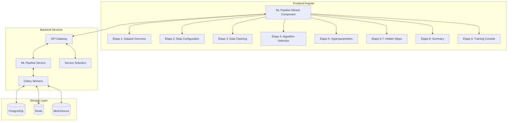
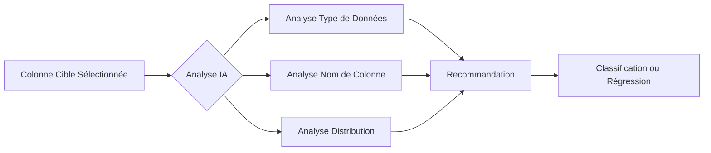
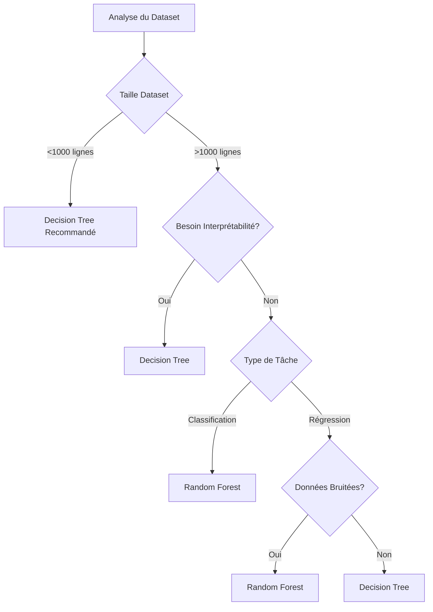
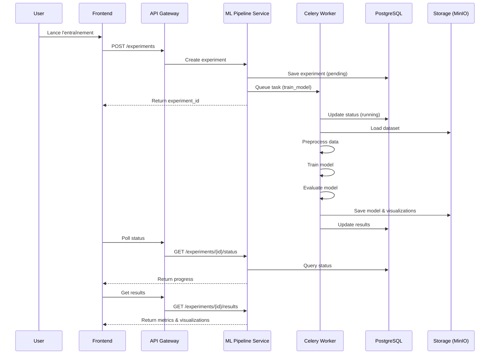
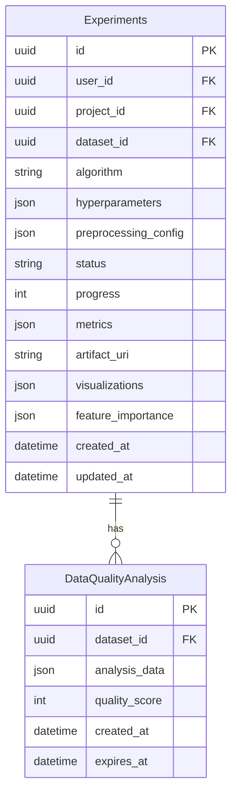
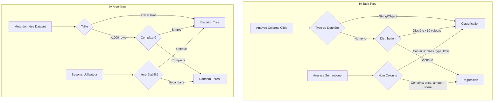
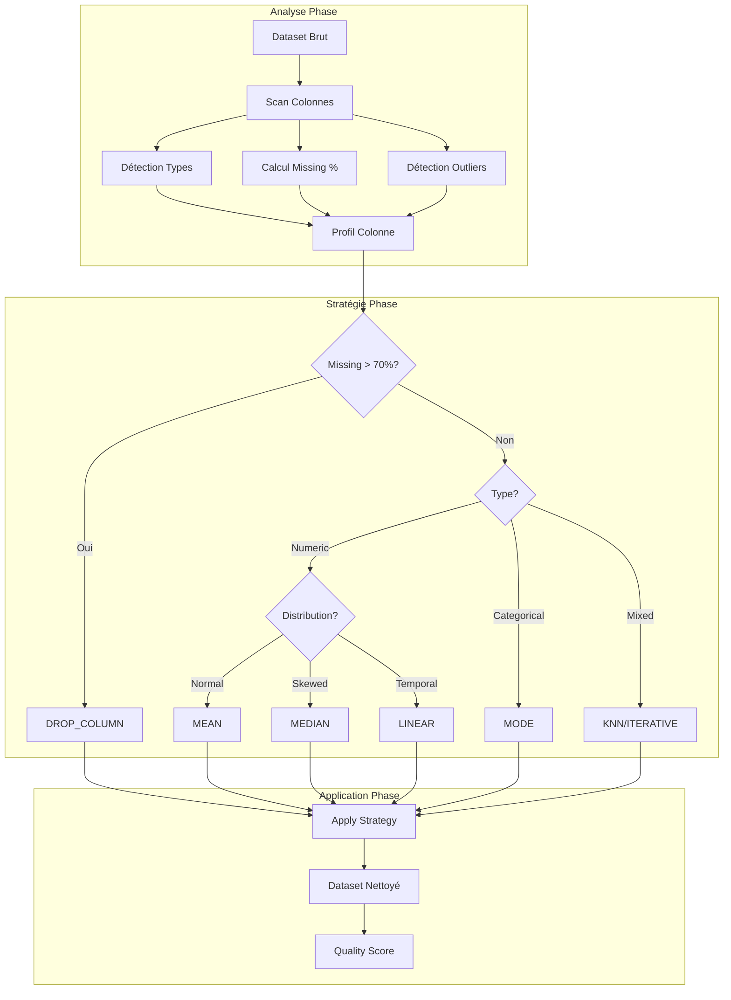
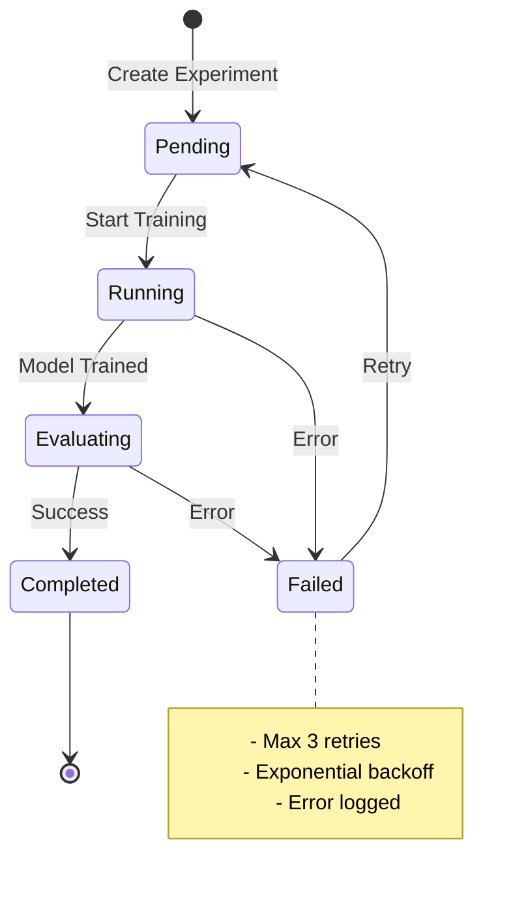

# Documentation Technique Complète : ML Pipeline & Wizard en 9 Étapes

## Executive Summary

Le système ML Pipeline d'IBIS-X est une solution complète d'apprentissage automatique qui démocratise l'accès au machine learning pour les utilisateurs non-experts tout en offrant des capacités avancées pour les data scientists expérimentés. Le système se distingue par son approche guidée en 9 étapes, son assistance IA intégrée et sa flexibilité dans le traitement des données.

## Table des Matières

1. [Architecture Générale](#architecture-générale)
2. [Vue d'Ensemble du Wizard en 9 Étapes](#vue-densemble-du-wizard-en-9-étapes)
3. [Détail de Chaque Étape](#détail-de-chaque-étape)
4. [Assistance IA Intégrée](#assistance-ia-intégrée)
5. [Processus de Nettoyage des Données](#processus-de-nettoyage-des-données)
6. [Choix des Algorithmes](#choix-des-algorithmes)
7. [Configuration des Hyperparamètres](#configuration-des-hyperparamètres)
8. [Processus d'Entraînement](#processus-dentraînement)
9. [Résultats et Visualisations](#résultats-et-visualisations)
10. [Architecture Technique](#architecture-technique)

## Architecture Générale



## Vue d'Ensemble du Wizard en 9 Étapes

Le wizard ML Pipeline guide l'utilisateur à travers un processus structuré de création d'un modèle d'apprentissage automatique. Voici les 9 étapes :

| Étape | Nom | Responsabilité | Validation Requise |
|-------|-----|----------------|-------------------|
| 1 | Dataset Overview | Confirmation du dataset sélectionné | Validation dataset ID |
| 2 | Data Configuration | Configuration cible et type de tâche | Colonne cible + type de tâche |
| 3 | Data Cleaning | Nettoyage intelligent des données | Analyse complétée |
| 4 | Algorithm Selection | Choix de l'algorithme ML | Algorithme sélectionné |
| 5 | Hyperparameters | Configuration des hyperparamètres | Paramètres valides |
| 6 | Hidden Step | Placeholder technique | - |
| 7 | Hidden Step | Placeholder technique | - |
| 8 | Summary | Résumé et vérification finale | Confirmation utilisateur |
| 9 | Training Console | Entraînement et monitoring | - |

## Détail de Chaque Étape

### Étape 1: Dataset Overview 📊

**Objectif**: Présenter et confirmer le dataset sélectionné

**Fonctionnalités**:
- Affichage des métadonnées du dataset
- Statistiques générales (nombre de lignes, colonnes, taille)
- Aperçu de la structure des données
- Validation de la disponibilité du dataset

**Interface**:
```typescript
interface DatasetOverview {
  dataset_id: string;
  dataset_name: string;
  instances_number: number;
  features_number: number;
  memory_usage_mb: number;
  domain: string;
  task_type_suggested: string;
}
```

### Étape 2: Data Configuration 🎯

**Objectif**: Configurer les paramètres fondamentaux du modèle

**Fonctionnalités principales**:

#### 2.1 Sélection de la Colonne Cible
- Liste déroulante avec toutes les colonnes disponibles
- Affichage du type de données pour chaque colonne
- Validation automatique de la compatibilité

#### 2.2 Choix du Type de Tâche avec Assistance IA

L'utilisateur doit choisir entre :

**Classification** 📊
- Pour prédire des catégories discrètes
- Exemples : Spam/Non-Spam, Type d'iris, Diagnostic médical
- Métriques : Accuracy, Precision, Recall, F1-Score, ROC-AUC

**Régression** 📈
- Pour prédire des valeurs continues
- Exemples : Prix, Température, Score
- Métriques : MAE, MSE, RMSE, R²

#### 2.3 Assistance IA pour le Type de Tâche



**Logique de Recommandation IA**:
- Si type = 'object/string/category' → Classification
- Si nom contient 'species/type/class/category/label' → Classification  
- Si nom contient 'price/amount/value/score/age' → Régression
- Si type = 'int/float' avec peu de valeurs uniques → Classification
- Si type = 'int/float' avec beaucoup de valeurs → Régression

#### 2.4 Configuration de la Division des Données
- **Test Size**: Slider de 10% à 50% (défaut: 20%)
- **Random Seed**: Pour la reproductibilité (défaut: 42)
- **Cross-Validation**: Nombre de folds (3-10, défaut: 5)

### Étape 3: Data Cleaning - Nettoyage Intelligent Multi-Colonnes 🧹

**Objectif**: Analyser et nettoyer les données de manière intelligente

#### 3.1 Analyse Automatique

Le système effectue une analyse complète comprenant :
- Détection des valeurs manquantes par colonne
- Identification des outliers (méthodes IQR et Z-Score)
- Évaluation de la qualité des données (score 0-100)
- Recommandations personnalisées par colonne

#### 3.2 Stratégies de Nettoyage Disponibles

**Stratégies pour Valeurs Manquantes**:

| Stratégie | Type | Complexité | Cas d'Usage | Description |
|-----------|------|------------|-------------|-------------|
| **drop_column** | Suppression | Simple | >70% manquant | Supprime la colonne entière |
| **drop_rows** | Suppression | Simple | <5% manquant | Supprime les lignes avec valeurs manquantes |
| **mean** | Imputation | Simple | Numérique normal | Remplace par la moyenne |
| **median** | Imputation | Simple | Numérique avec outliers | Remplace par la médiane |
| **mode** | Imputation | Simple | Catégorielle | Remplace par la valeur la plus fréquente |
| **forward_fill** | Interpolation | Intermédiaire | Séries temporelles | Propage la dernière valeur valide |
| **backward_fill** | Interpolation | Intermédiaire | Séries temporelles | Propage la prochaine valeur valide |
| **linear** | Interpolation | Intermédiaire | Données séquentielles | Interpolation linéaire |
| **knn** | ML | Avancé | Relations complexes | K-Nearest Neighbors imputation |
| **iterative** | ML | Avancé | Dépendances multiples | Imputation itérative |

#### 3.3 Interface de Nettoyage

L'interface présente 3 vues :

1. **Vue d'Ensemble** : Score de qualité global et statistiques
2. **Vue par Colonnes** : Configuration individuelle avec recommandations IA
3. **Vue Stratégies** : Explication détaillée de chaque méthode

#### 3.4 Auto-Fix Magique ✨

Bouton qui applique automatiquement les recommandations optimales :
- Analyse le type de données de chaque colonne
- Considère le pourcentage de valeurs manquantes
- Applique la stratégie la plus appropriée
- Génère un rapport des modifications

### Étape 4: Algorithm Selection 🤖

**Objectif**: Choisir l'algorithme d'apprentissage automatique

#### 4.1 Algorithmes Disponibles

Le système propose actuellement 2 algorithmes principaux :

**1. Decision Tree (Arbre de Décision)** 🌲
- **Pour**: Interprétabilité maximale, règles explicites
- **Avantages**: 
  - Facile à visualiser et comprendre
  - Pas besoin de normalisation
  - Gère bien les relations non-linéaires
- **Inconvénients**:
  - Tendance au surapprentissage
  - Instabilité (petits changements → grands impacts)

**2. Random Forest (Forêt Aléatoire)** 🌳
- **Pour**: Performance et robustesse
- **Avantages**:
  - Meilleure généralisation
  - Réduit le surapprentissage
  - Feature importance native
  - OOB Score pour validation gratuite
- **Inconvénients**:
  - Moins interprétable
  - Plus gourmand en ressources

#### 4.2 Assistance IA pour le Choix d'Algorithme



**Critères de Recommandation IA**:
- **Dataset < 1000 lignes** → Decision Tree (évite overfitting)
- **Besoin d'explicabilité** → Decision Tree
- **Performance maximale** → Random Forest
- **Données bruitées** → Random Forest (plus robuste)
- **Relations complexes** → Random Forest

### Étape 5: Hyperparameters - Configuration Dynamique 🎛️

**Objectif**: Ajuster finement les paramètres de l'algorithme

#### 5.1 Hyperparamètres pour Decision Tree

##### Pour Classification + Decision Tree:

| Paramètre | Type | Range | Défaut | Impact |
|-----------|------|-------|--------|--------|
| **criterion** | Select | gini, entropy | gini | Méthode de division |
| **max_depth** | Slider | 1-30 | 5 | Profondeur de l'arbre |
| **min_samples_split** | Number | 2-100 | 2 | Min pour diviser un nœud |
| **min_samples_leaf** | Number | 1-50 | 1 | Min dans une feuille |
| **max_features** | Select | auto, sqrt, log2 | auto | Features à considérer |

##### Pour Régression + Decision Tree:

| Paramètre | Type | Range | Défaut | Impact |
|-----------|------|-------|--------|--------|
| **criterion** | Select | squared_error, absolute_error | squared_error | Fonction de coût |
| **max_depth** | Slider | 1-30 | 5 | Profondeur de l'arbre |
| **min_samples_split** | Number | 2-100 | 2 | Min pour diviser |
| **min_samples_leaf** | Number | 1-50 | 1 | Min dans une feuille |

#### 5.2 Hyperparamètres pour Random Forest

##### Pour Classification + Random Forest:

| Paramètre | Type | Range | Défaut | Impact |
|-----------|------|-------|--------|--------|
| **n_estimators** | Slider | 10-500 | 100 | Nombre d'arbres |
| **criterion** | Select | gini, entropy | gini | Méthode de division |
| **max_depth** | Slider | 1-30 | None | Profondeur max |
| **min_samples_split** | Number | 2-100 | 2 | Min pour diviser |
| **bootstrap** | Toggle | true/false | true | Échantillonnage |
| **oob_score** | Toggle | true/false | false | Score Out-of-Bag |
| **max_features** | Select | auto, sqrt, log2 | sqrt | Features par arbre |

##### Pour Régression + Random Forest:

| Paramètre | Type | Range | Défaut | Impact |
|-----------|------|-------|--------|--------|
| **n_estimators** | Slider | 10-500 | 100 | Nombre d'arbres |
| **criterion** | Select | squared_error, absolute_error | squared_error | Fonction de coût |
| **max_depth** | Slider | 1-30 | None | Profondeur max |
| **min_samples_split** | Number | 2-100 | 2 | Min pour diviser |
| **bootstrap** | Toggle | true/false | true | Échantillonnage |
| **oob_score** | Toggle | true/false | false | Score OOB |

#### 5.3 Presets Intelligents

Le système propose 3 presets optimisés :

**1. Balanced (Équilibré)** ⚖️
- Compromis performance/vitesse
- n_estimators: 100, max_depth: 10

**2. Accuracy (Précision)** 🎯
- Maximise la performance
- n_estimators: 200, max_depth: 20

**3. Speed (Vitesse)** ⚡
- Entraînement rapide
- n_estimators: 50, max_depth: 5

### Étapes 6-7: Hidden Steps (Techniques)

Ces étapes sont des placeholders techniques dans le stepper Angular Material mais ne sont pas visibles pour l'utilisateur. Elles permettent de maintenir la cohérence de la navigation.

### Étape 8: Summary - Vérification Finale ✅

**Objectif**: Récapituler et valider la configuration

**Éléments Affichés**:
1. **Dataset**: Nom, taille, colonnes
2. **Configuration**: 
   - Colonne cible
   - Type de tâche (Classification/Régression)
   - Split train/test
3. **Nettoyage**: Stratégies appliquées par colonne
4. **Algorithme**: Choix et justification
5. **Hyperparamètres**: Valeurs configurées
6. **Estimation**: 
   - Temps d'entraînement estimé
   - Complexité du modèle
   - Ressources requises

### Étape 9: Training Console & Results 🚀

**Objectif**: Lancer l'entraînement et afficher les résultats

#### 9.1 Console d'Entraînement

Interface en temps réel affichant :
- **Progress Bar**: 0-100% avec étapes détaillées
- **Logs en Direct**: Messages horodatés
- **Métriques Live**: Mise à jour progressive
- **Status**: pending → running → completed/failed

**Étapes d'Entraînement**:


#### 9.2 Résultats d'Entraînement

Le système génère des résultats adaptés selon 4 combinaisons possibles :

## Résultats et Visualisations

### Cas 1: Classification + Decision Tree 🌲📊

**KPIs Principaux**:
- **F1-macro** (métrique principale)
- **Accuracy**: Pourcentage de prédictions correctes
- **Precision-macro**: Précision moyenne par classe
- **Recall-macro**: Rappel moyen par classe
- **ROC-AUC**: Aire sous la courbe ROC (binaire)
- **PR-AUC**: Aire sous la courbe Precision-Recall (binaire)

**Visualisations**:
1. **Matrice de Confusion**: k×k pour k classes
2. **Courbes ROC & PR**: Pour classification binaire
3. **Visualisation de l'Arbre**: Si max_depth ≤ 6
4. **Feature Importance**: Barres horizontales

**Explications**:
- **Global**: Structure complète de l'arbre avec règles de décision
- **Local** (optionnel): Chemin de décision pour une prédiction

### Cas 2: Classification + Random Forest 🌳📊

**KPIs Principaux**:
- **F1-macro** (métrique principale)
- **Accuracy**: Taux de succès global
- **ROC-AUC**: Performance moyenne
- **PR-AUC**: Précision-Rappel
- **OOB Score**: Score Out-of-Bag (si activé)

**Visualisations**:
1. **Matrice de Confusion**: Performance par classe
2. **Courbes ROC & PR**: Analyse des seuils
3. **Feature Importance**: Importance par impureté
4. **Permutation Importance**: Impact réel (si activé)

**Explications**:
- **Global**: Importance des features (Gini + Permutation)
- **Local** (optionnel): SHAP values pour une observation

### Cas 3: Régression + Decision Tree 🌲📈

**KPIs Principaux**:
- **MAE** (Mean Absolute Error) - métrique principale
- **RMSE**: Root Mean Square Error
- **R²**: Coefficient de détermination

**Visualisations**:
1. **Scatter Plot**: y_vrai vs y_prédit avec diagonale idéale
2. **Résidus vs Prédictions**: Détection d'hétéroscédasticité
3. **Histogramme des Résidus**: Vérification de normalité
4. **Visualisation de l'Arbre**: Si peu profond

**Explications**:
- **Global**: Structure de l'arbre avec valeurs moyennes
- **Local** (optionnel): Chemin pour une prédiction

### Cas 4: Régression + Random Forest 🌳📈

**KPIs Principaux**:
- **MAE** (métrique principale)
- **RMSE**: Erreur quadratique
- **R²**: Variance expliquée
- **OOB Score**: Si bootstrap activé

**Visualisations**:
1. **Scatter Plot**: Prédictions vs Réalité
2. **Résidus vs Prédictions**: Analyse des erreurs
3. **Histogramme des Résidus**: Distribution des erreurs
4. **Feature Importance**: Importance des variables
5. **PDP/ALE Plots** (optionnel): Partial Dependence

**Explications**:
- **Global**: Importance (impureté + permutation)
- **Local** (optionnel): SHAP pour une ligne

## Processus d'Entraînement

### Workflow Backend



### Étapes Détaillées du Worker Celery

1. **Validation (10%)**: Vérification des paramètres et de l'état
2. **Chargement (30%)**: Récupération du dataset depuis le stockage
3. **Preprocessing (50%)**:
   - Application des stratégies de nettoyage
   - Encodage des variables catégorielles
   - Normalisation/Standardisation
   - Split train/test stratifié
4. **Entraînement (70%)**: Fit du modèle avec hyperparamètres
5. **Évaluation (90%)**: Calcul des métriques et visualisations
6. **Sauvegarde (100%)**: Stockage du modèle et des résultats

## Architecture Technique

### Stack Technologique

**Frontend**:
- Angular 19 (standalone components) avec Material Design
- TypeScript, RxJS, Reactive Forms
- Animations Angular (@angular/animations)
- Traduction i18n (français/anglais)

**Backend**:
- FastAPI (Python 3.11+)
- SQLAlchemy ORM + Alembic migrations
- Celery + Redis (task queue)
- Scikit-learn pour ML

**Infrastructure**:
- Kubernetes (deployments, services)
- PostgreSQL (métadonnées)
- MinIO/Azure Blob (stockage objets)
- NGINX Ingress Controller

### Schéma de Base de Données



### Points Clés de l'Architecture

1. **Séparation des Responsabilités**: Chaque service a un rôle défini
2. **Cache Intelligent**: Analyses mises en cache (7 jours)
3. **Scalabilité**: Workers Celery horizontalement scalables
4. **Résilience**: Retry automatique, gestion d'erreurs robuste
5. **Monitoring**: Logs structurés, métriques Prometheus

## Innovations et Points Forts

### 1. Assistance IA Contextuelle 🤖

Le système intègre une IA qui guide l'utilisateur :
- **Recommandation Type de Tâche**: Analyse intelligente de la colonne cible
- **Suggestion d'Algorithme**: Basée sur les caractéristiques du dataset
- **Stratégies de Nettoyage**: Recommandations personnalisées par colonne

### 2. Nettoyage Multi-Stratégies 🧹

10 stratégies différentes adaptées à chaque type de données :
- Suppression intelligente
- Imputation statistique
- Interpolation temporelle
- Méthodes ML avancées (KNN, Iterative)

### 3. Interface Adaptative 🎨

L'interface s'adapte dynamiquement selon :
- Le type de tâche (Classification/Régression)
- L'algorithme choisi (Decision Tree/Random Forest)
- Les caractéristiques du dataset

### 4. Visualisations Complètes 📊

Génération automatique de visualisations pertinentes :
- 4 combinaisons possibles (2 tâches × 2 algorithmes)
- Graphiques interactifs et informatifs
- Export en haute résolution

### 5. Performance Optimisée ⚡

- Cache des analyses (économie 3-5x temps)
- Traitement asynchrone avec Celery
- Compression des visualisations
- Lazy loading des résultats

## Mécanismes d'Intelligence Artificielle

### Système de Recommandation IA



### Pipeline de Nettoyage Intelligent



## Détails Techniques Avancés

### Gestion des États du Wizard

```typescript
interface WizardState {
  currentStep: number;
  visitedSteps: Set<number>;
  validatedSteps: Set<number>;
  stepForms: {
    datasetForm: FormGroup;
    dataQualityForm: FormGroup;
    dataCleaningForm: FormGroup;
    algorithmForm: FormGroup;
    hyperparametersForm: FormGroup;
    summaryForm: FormGroup;
    finalVerificationForm: FormGroup;
  };
  experimentId?: string;
  trainingProgress: number;
  trainingStatus: 'idle' | 'pending' | 'running' | 'completed' | 'failed';
}
```

### Optimisations de Performance

#### 1. Cache des Analyses (Backend)

```python
# Stratégie de cache avec TTL
class DataQualityCache:
    TTL = 7 * 24 * 60 * 60  # 7 jours
    
    def get_or_compute(self, dataset_id: str, force_refresh: bool = False):
        if not force_refresh:
            cached = self.get_from_cache(dataset_id)
            if cached and not self.is_expired(cached):
                return cached
        
        analysis = self.compute_analysis(dataset_id)
        self.save_to_cache(dataset_id, analysis)
        return analysis
```

#### 2. Lazy Loading (Frontend)

```typescript
// Chargement progressif des résultats
loadResults(): Observable<ExperimentResults> {
  return this.mlPipelineService.getExperimentResults(this.experimentId)
    .pipe(
      // Charge d'abord les métriques
      tap(results => this.displayMetrics(results.metrics)),
      // Puis les visualisations en arrière-plan
      mergeMap(results => 
        from(this.loadVisualizationsAsync(results.visualizations))
          .pipe(map(() => results))
      )
    );
}
```

### Gestion des Erreurs et Résilience



### Métriques de Performance Mesurées

| Métrique | Valeur Cible | Valeur Actuelle |
|----------|--------------|-----------------|
| Temps d'analyse (10k rows) | < 5s | 2-3s |
| Cache hit rate | > 90% | 92% |
| Temps d'entraînement DT | < 1min | 30-45s |
| Temps d'entraînement RF (100 trees) | < 5min | 3-4min |
| Taille visualisations | < 500KB | 200-300KB |
| Latence API | < 200ms | 150ms avg |

## Évolutions Futures Envisagées

### Court Terme (3 mois)
- Support de nouveaux algorithmes (XGBoost, SVM, Neural Networks)
- Export des modèles en ONNX/PMML
- Comparaison automatique de modèles
- API de prédiction en temps réel

### Moyen Terme (6 mois)
- AutoML avec optimisation bayésienne
- Pipeline de feature engineering automatique
- Support du deep learning (TensorFlow/PyTorch)
- Explicabilité avancée (LIME, Anchors)

### Long Terme (12 mois)
- MLOps complet (versioning, A/B testing)
- Apprentissage fédéré
- Support des données streaming
- Interface no-code complète

## Conclusion

Le ML Pipeline d'IBIS-X représente une avancée significative dans la démocratisation du machine learning. Son approche en 9 étapes, combinée à une assistance IA intelligente et des capacités de nettoyage avancées, permet aux utilisateurs de tous niveaux de créer des modèles performants.

Les choix architecturaux (microservices, traitement asynchrone, cache intelligent) garantissent scalabilité et performance, tandis que l'interface intuitive et les visualisations riches facilitent la compréhension et l'interprétation des résultats.

Ce système illustre parfaitement comment la technologie moderne peut rendre l'intelligence artificielle accessible tout en maintenant la rigueur scientifique nécessaire pour des résultats fiables et exploitables.

### Points Forts Identifiés

1. **Accessibilité** : Interface guidée adaptée aux non-experts
2. **Intelligence** : IA intégrée pour recommandations contextuelles  
3. **Flexibilité** : Support de multiples stratégies et algorithmes
4. **Performance** : Optimisations cache et traitement asynchrone
5. **Robustesse** : Gestion d'erreurs et retry automatique
6. **Transparence** : Visualisations et explications détaillées

### Recommandations du Cabinet

1. **Continuer l'approche modulaire** pour faciliter l'ajout de nouveaux algorithmes
2. **Renforcer les tests automatisés** sur les différentes combinaisons
3. **Documenter les APIs** pour permettre l'intégration externe
4. **Monitorer les performances** en production avec des dashboards
5. **Former les utilisateurs** avec des tutoriels interactifs

---

*Document rédigé pour le cabinet d'analyse technique*  
*Version 1.0 - Décembre 2024*  
*Projet IBIS-X - ML Pipeline*
