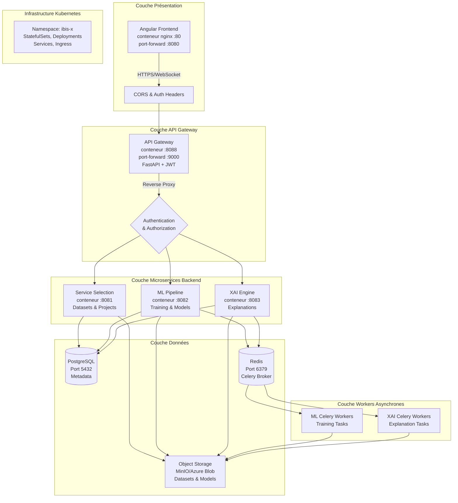
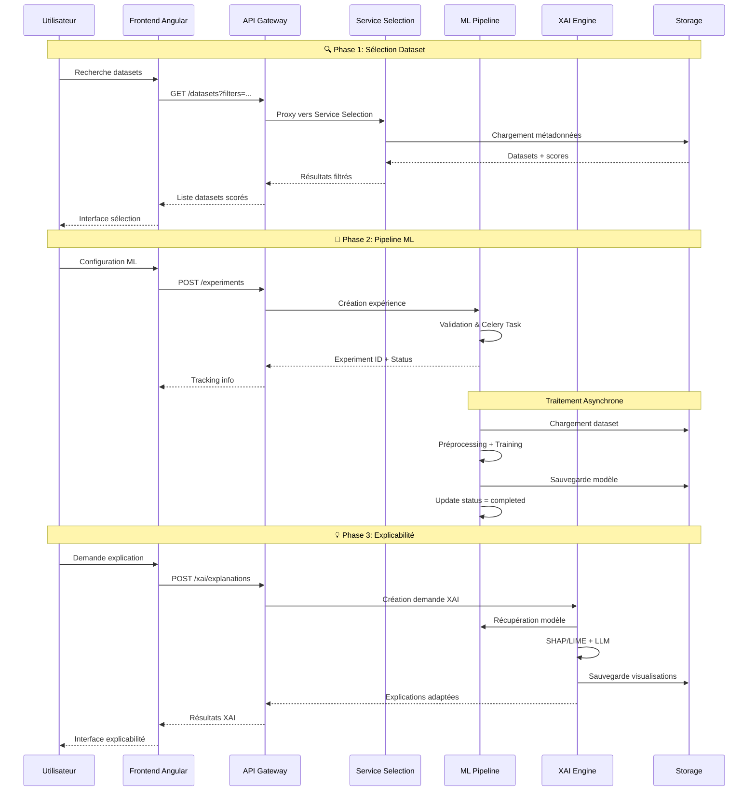
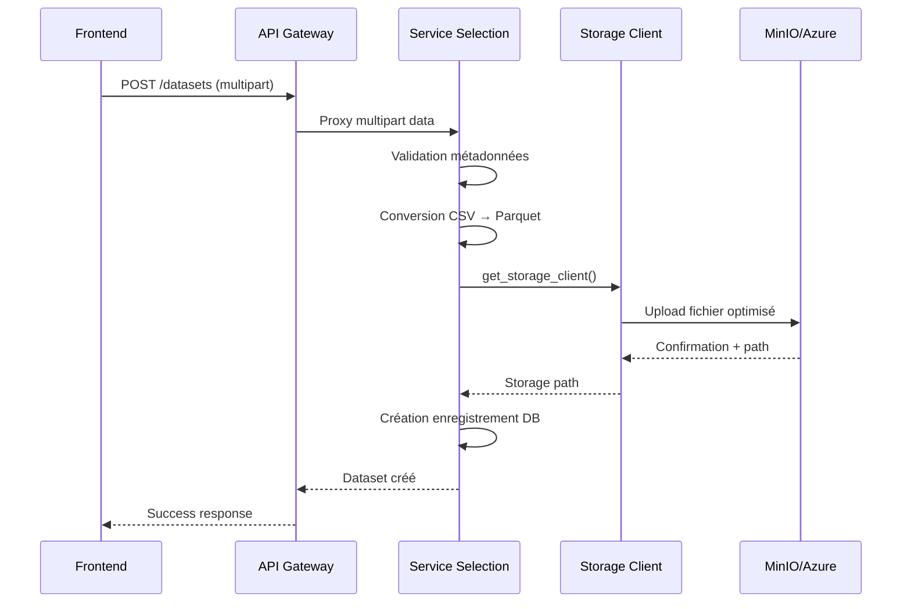
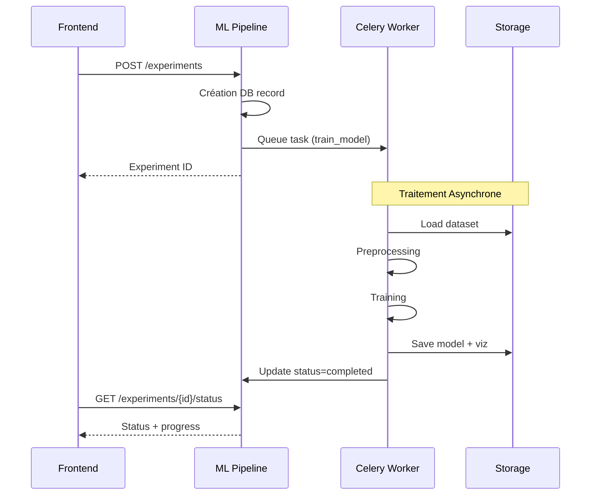
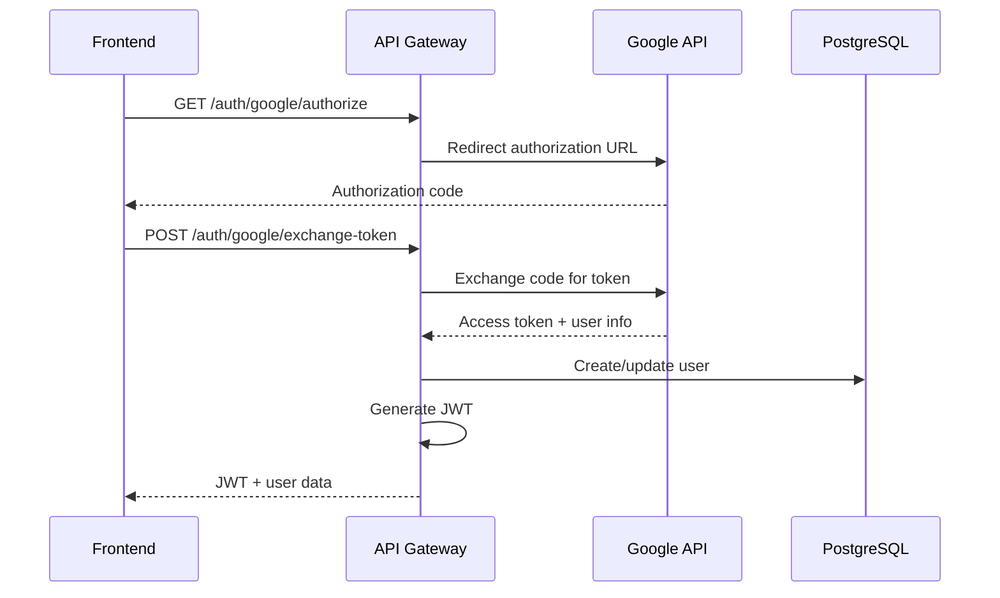

# Documentation Technique Complète : Architecture du Système IBIS-X EXAI

## Table des Matières
1. [Vue d'Ensemble et Objectifs](#vue-d-ensemble-et-objectifs)
2. [Architecture Générale](#architecture-générale)
3. [Vue d'Ensemble du Pipeline Intégré](#vue-d-ensemble-du-pipeline-intégré)
4. [Architecture Microservices](#architecture-microservices)
5. [Interactions et Flux de Données](#interactions-et-flux-de-données)
6. [Infrastructure Kubernetes](#infrastructure-kubernetes)
7. [Système de Stockage d'Objets](#système-de-stockage-d-objets)
8. [Frontend Angular](#frontend-angular)
9. [Sécurité et Authentification](#sécurité-et-authentification)
10. [Monitoring et Observabilité](#monitoring-et-observabilité)
11. [Déploiement et CI/CD](#déploiement-et-cicd)

---

## 1. Vue d'Ensemble et Objectifs

### 1.1 Mission du Projet EXAI

Le système IBIS-X (Integrated Business Intelligence and Selection eXplainable AI) répond à trois défis fondamentaux du machine learning pour les utilisateurs non-experts :

1. **Sélection de Jeux de Données** : Aide guidée pour choisir des datasets appropriés selon des critères techniques et éthiques
2. **Pipeline ML Interactif** : Accompagnement dans les étapes clés du ML (prétraitement, choix d'algorithme, évaluation)
3. **Recommandation XAI** : Techniques d'explicabilité adaptées au contexte et au profil utilisateur

### 1.2 Approche Architecturale

L'architecture suit une approche **microservices conteneurisés** orchestrés par **Kubernetes** pour garantir :
- **Modularité** : Chaque service a des responsabilités clairement définies
- **Scalabilité** : Déploiement et mise à l'échelle indépendante des composants
- **Maintenabilité** : Code propre, typage strict, migrations contrôlées
- **Résilience** : Tolérance aux pannes et récupération automatique

## 2. Architecture Générale

### 2.1 Diagramme d'Architecture Globale



### 2.2 Technologies Principales

| Composant | Technologies | Justification |
|-----------|-------------|---------------|
| **Frontend** | Angular 19 (standalone) + Angular Material + ngx-translate FR/EN + ECharts + WebSHAP + TypeScript | SPA moderne avec composants UI cohérents |
| **API Gateway** | FastAPI + fastapi-users + JWT | Performance élevée, validation automatique, auth intégrée |
| **Microservices** | FastAPI + SQLAlchemy + Pydantic + Alembic | Stack Python cohérente, ORM robuste, migrations |
| **Base de Données** | PostgreSQL 15 | ACID compliance, support JSONB, performance |
| **Message Broker** | Redis 7 | Performance, simplicité, support natif Celery |
| **Workers Async** | Celery + Redis | Traitement asynchrone fiable, scaling horizontal |
| **Stockage** | MinIO (dev) / Azure Blob (prod) | Compatibilité S3, économique, scalable |
| **Orchestration** | Kubernetes + Docker | Standard industrie, portabilité, résilience |
| **CI/CD** | Skaffold + Kustomize | Développement local simplifié, config multi-env |

## 3. Vue d'Ensemble du Pipeline Intégré

### 3.1 Flux Utilisateur Principal



### 3.2 Intégration des Trois Modules

Le système EXAI se distingue par l'**intégration transparente** de trois modules traditionnellement séparés :

1. **Module Sélection** : Critères techniques ET éthiques (conformité RGPD, anonymisation, équité)
2. **Module ML Pipeline** : Guidage interactif adapté aux non-experts
3. **Module XAI** : Recommandation contextuelle et personnalisation selon le profil utilisateur

Cette intégration permet un **flux continu** sans rupture d'expérience utilisateur.

## 4. Architecture Microservices

### 4.1 API Gateway (`api-gateway/`)

**Responsabilités :**
- Point d'entrée unique pour toutes les requêtes frontend
- Authentification JWT via fastapi-users
- Reverse proxy intelligent vers les services backend
- Gestion CORS et headers de sécurité
- Logging centralisé des requêtes

**Endpoints Principaux :**
- `/auth/*` : Authentification (login, register, OAuth Google)
- `/users/*` : Gestion profils utilisateur
- `/datasets/*` : Proxy vers service-selection
- `/projects/*` : Proxy vers service-selection
- `/api/v1/ml-pipeline/*` : Proxy vers ml-pipeline-service
- `/api/v1/xai/*` : Proxy vers xai-engine-service

**Technologies :**
- FastAPI avec middleware CORS
- fastapi-users pour authentification OAuth2/JWT
- httpx pour requêtes proxy asynchrones
- SQLAlchemy + Alembic pour gestion utilisateurs

### 4.2 Service Selection (`service-selection/`)

**Responsabilités :**
- Catalogue de datasets avec métadonnées enrichies
- Système de scoring multi-critères (technique + éthique)
- Gestion des projets utilisateur
- Upload et conversion automatique CSV → Parquet
- Intégration système de stockage d'objets

**Modèle de Données :**
```sql
-- Structure normalisée pour datasets
CREATE TABLE datasets (
    id UUID PRIMARY KEY,
    name VARCHAR(200) NOT NULL,
    description TEXT,
    domain TEXT[],
    task TEXT[],
    storage_path VARCHAR(500),
    -- Critères techniques
    num_instances INTEGER,
    num_features INTEGER,
    data_types JSONB,
    -- Critères éthiques (basés sur Khelifi et al., 2024)
    informed_consent BOOLEAN,
    transparency BOOLEAN,
    anonymization_applied BOOLEAN,
    -- Scoring et qualité
    popularity_score REAL,
    ethical_score REAL,
    technical_score REAL
);

-- Relations datasets-files normalisées
CREATE TABLE dataset_files (
    id UUID PRIMARY KEY,
    dataset_id UUID REFERENCES datasets(id),
    file_name_in_storage VARCHAR(255),
    format VARCHAR(50),
    size_bytes BIGINT,
    logical_role VARCHAR(100)
);
```

**APIs Principales :**
- `GET /datasets` : Liste avec filtrage avancé
- `POST /datasets/score` : Scoring personnalisé
- `POST /datasets` : Upload avec conversion automatique
- `GET/POST /projects` : Gestion projets utilisateur

### 4.3 ML Pipeline Service (`ml-pipeline-service/`)

**Responsabilités :**
- Orchestration des tâches d'entraînement ML via Celery
- Pipeline de preprocessing intelligent
- Support des algorithmes supervisés (Decision Tree, Random Forest)
- Génération de visualisations et métriques
- Système de versioning des modèles

**Workflow d'Entraînement :**
```python
@celery_app.task
def train_model(experiment_id: str):
    # 1. Validation (Progress: 10%)
    experiment = load_experiment(experiment_id)
    update_progress(experiment_id, 10, 'running')
    
    # 2. Chargement données (Progress: 30%)
    dataset = load_from_storage(experiment.dataset_id)
    update_progress(experiment_id, 30, 'running')
    
    # 3. Preprocessing (Progress: 50%)
    X_train, X_test, y_train, y_test = preprocess_data(
        dataset, experiment.preprocessing_config
    )
    update_progress(experiment_id, 50, 'running')
    
    # 4. Entraînement (Progress: 70%)
    model = create_model(experiment.algorithm, experiment.hyperparameters)
    model.fit(X_train, y_train)
    update_progress(experiment_id, 70, 'running')
    
    # 5. Évaluation (Progress: 90%)
    metrics = evaluate_model(model, X_test, y_test)
    visualizations = generate_visualizations(model, X_test, y_test)
    update_progress(experiment_id, 90, 'running')
    
    # 6. Sauvegarde (Progress: 100%)
    model_path = save_model_with_versioning(model, experiment_id)
    save_visualizations_to_storage(visualizations, experiment_id)
    
    # Finalisation
    complete_experiment(experiment_id, metrics, model_path, visualizations)
```

**Algorithmes Supportés :**
- **Decision Tree** : Classification/Régression avec hyperparamètres (criterion, max_depth, min_samples_split)
- **Random Forest** : Ensemble avec paramètres (n_estimators, max_depth, bootstrap)

### 4.4 XAI Engine Service (`xai-engine-service/`)

**Responsabilités :**
- Génération d'explications XAI (SHAP, LIME)
- Service LLM adaptatif avec OpenAI GPT
- Interface chatbot pour questions utilisateur
- Personnalisation selon audience_level et ai_familiarity

**Modèle de Données XAI :**
```sql
CREATE TABLE explanation_requests (
    id UUID PRIMARY KEY,
    user_id UUID NOT NULL,
    experiment_id UUID NOT NULL,
    explanation_type VARCHAR(50), -- global, local, feature_importance
    method_requested VARCHAR(50), -- shap, lime, auto
    audience_level VARCHAR(20),   -- novice, intermediate, expert
    ai_familiarity VARCHAR(20),   -- debutant, intermediaire, expert
    status VARCHAR(20),           -- pending, running, completed, failed
    llm_explanation TEXT,         -- Explication textuelle générée
    created_at TIMESTAMPTZ DEFAULT NOW()
);

CREATE TABLE explanation_artifacts (
    id UUID PRIMARY KEY,
    explanation_request_id UUID REFERENCES explanation_requests(id),
    artifact_type VARCHAR(50),    -- summary_plot, waterfall_plot, etc.
    file_path VARCHAR(500),       -- Chemin dans le stockage objets
    file_name VARCHAR(255)
);

CREATE TABLE chat_messages (
    id UUID PRIMARY KEY,
    explanation_request_id UUID REFERENCES explanation_requests(id),
    message_type VARCHAR(20),     -- user_question, ai_response
    content TEXT,
    tokens_used INTEGER,
    created_at TIMESTAMPTZ DEFAULT NOW()
);
```

**Service LLM Adaptatif :**
```python
def get_complexity_prompt(audience_level: str, ai_familiarity: str) -> str:
    if audience_level == "novice" or ai_familiarity == "debutant":
        return """Explique de manière très simple, sans jargon technique.
        Utilise des analogies et des exemples concrets."""
    elif audience_level == "expert" and ai_familiarity == "expert":
        return """Fournis une analyse technique détaillée avec métriques,
        coefficients et recommandations d'optimisation."""
    else:
        return """Explique de manière claire et structurée avec un niveau
        intermédiaire de détail technique."""
```

## 5. Interactions et Flux de Données

### 5.1 Communication Inter-Services

**Pattern de Communication :**
- **Synchrone** : Frontend ↔ API Gateway ↔ Services (REST/HTTP)
- **Asynchrone** : Services → Celery Workers via Redis
- **Authentification** : JWT propagé via headers `X-User-ID`

**Gestion des Headers :**
```python
async def proxy_request(request: Request, service_url: str, path: str, current_user):
    headers = {
        "X-User-ID": str(current_user.id),
        "X-User-Email": current_user.email,
        "X-User-Role": current_user.role,
        "Content-Type": "application/json"
    }
    
    async with httpx.AsyncClient() as client:
        response = await client.request(
            method=request.method,
            url=f"{service_url}/{path}",
            headers=headers,
            content=await request.body()
        )
        return response
```

### 5.2 Flux de Données Critiques

**1. Upload de Dataset :**


**2. Entraînement ML :**


## 6. Infrastructure Kubernetes

### 6.1 Architecture des Déploiements

**Namespace :** `ibis-x`

**Composants Principaux :**
```yaml
# StatefulSets (données persistantes)
- PostgreSQL (postgresql-statefulset.yaml)
- Redis (redis-statefulset.yaml)
- MinIO (minio-deployment.yaml avec PVC)

# Deployments (services stateless)
- Frontend (deployment.yaml)
- API Gateway (deployment.yaml)
- Service Selection (deployment.yaml)
- ML Pipeline API (deployment.yaml)
- XAI Engine API (deployment.yaml)

# Celery Workers (scalables)
- ML Pipeline Workers (celery-worker-deployment.yaml)
- XAI Engine Workers (celery-worker-deployment.yaml)

# Jobs (migrations et tâches ponctuelles)
- Database Migration Jobs
- Kaggle Import Jobs
```

### 6.2 Configuration Multi-Environnement avec Kustomize

**Structure :**
```
k8s/
├── base/                 # Configurations communes
│   ├── api-gateway/
│   ├── frontend/
│   ├── service-selection/
│   ├── ml-pipeline/
│   ├── xai-engine/
│   ├── postgres/
│   ├── redis/
│   └── minio/
├── overlays/
│   ├── minikube/         # Développement local
│   ├── azure/            # Production Azure
│   └── minikube-no-jobs/ # Déploiement sans jobs
```

**Exemple de Patch d'Environnement :**
```yaml
# k8s/overlays/azure/images-patch.yaml
images:
- name: frontend
  newName: ibisprodacr.azurecr.io/frontend
- name: ibis-x-api-gateway
  newName: ibisprodacr.azurecr.io/exai-api-gateway
- name: service-selection
  newName: ibisprodacr.azurecr.io/service-selection

patches:
- path: storage-azure-patch.yaml  # Variables pour Azure Blob
- path: ingress-production-patch.yaml  # URLs production
```

### 6.3 Gestion des Secrets

**Secrets Kubernetes :**
```yaml
# gateway-secrets.yaml
apiVersion: v1
kind: Secret
metadata:
  name: gateway-secrets
  namespace: ibis-x
data:
  database-url: <base64_encoded>
  jwt-secret: <base64_encoded>
  google-client-id: <base64_encoded>
  google-client-secret: <base64_encoded>

# storage-credentials
apiVersion: v1
kind: Secret
metadata:
  name: storage-credentials
  namespace: ibis-x
data:
  access-key: <minio_access_key>
  secret-key: <minio_secret_key>
```

### 6.4 Monitoring et Health Checks

**Probes Configuration :**
```yaml
# Exemple pour ML Pipeline
livenessProbe:
  httpGet:
    path: /health
    port: 8082
  initialDelaySeconds: 30
  periodSeconds: 60
  failureThreshold: 3

readinessProbe:
  httpGet:
    path: /health
    port: 8082
  initialDelaySeconds: 10
  periodSeconds: 5
  failureThreshold: 2
```

## 7. Système de Stockage d'Objets

### 7.1 Innovation Architecture Hybride

**Transformation Majeure :** Évolution d'un système metadata-only vers stockage réel haute performance.

**Architecture Multi-Cloud :**
```python
# common/storage_client.py - Factory Pattern
def get_storage_client() -> Union[MinIOStorageClient, AzureBlobStorageClient]:
    backend = os.getenv('STORAGE_BACKEND')
    if backend == 'minio':
        return MinIOStorageClient(
            endpoint_url=os.getenv('STORAGE_ENDPOINT_URL'),
            access_key=os.getenv('STORAGE_ACCESS_KEY'),
            secret_key=os.getenv('STORAGE_SECRET_KEY')
        )
    elif backend == 'azure':
        return AzureBlobStorageClient(
            account_name=os.getenv('STORAGE_ACCESS_KEY'),
            account_key=os.getenv('STORAGE_SECRET_KEY')
        )
```

### 7.2 Conversion Automatique CSV → Parquet

**Gains de Performance Exceptionnels :**
- **Compression** : Réduction 80-90% taille stockage
- **Vitesse lecture** : 10-50x plus rapide
- **Optimisations** : Types natifs, indexation colonnaire, predicate pushdown

**Algorithme de Conversion :**
```python
def convert_to_parquet(file_content: bytes, filename: str) -> bytes:
    # 1. Lecture CSV avec inférence types automatique
    df = pd.read_csv(io.BytesIO(file_content), dtype_backend='pyarrow')
    
    # 2. Optimisations spécifiques
    for col in df.columns:
        if df[col].dtype == 'object':
            # Conversion string → categorical si < 50% valeurs uniques
            if df[col].nunique() / len(df) < 0.5:
                df[col] = df[col].astype('category')
    
    # 3. Compression intelligente
    parquet_buffer = io.BytesIO()
    df.to_parquet(
        parquet_buffer,
        compression='snappy',      # Équilibre vitesse/taille
        use_dictionary=True,       # Compression dictionnaire
        row_group_size=100000      # Optimisé pour datasets ML
    )
    
    return parquet_buffer.getvalue()
```

### 7.3 Exemple Concret de Gains

**Dataset EdNet (131M lignes, 10 colonnes) :**
- **CSV Original** : 5.2 GB, 45s lecture
- **Parquet Optimisé** : 520 MB, 2s lecture
- **Gain** : 95% réduction taille, 95% réduction temps

## 8. Frontend Angular

### 8.1 Architecture Modulaire

**Structure Organisationnelle :**
```
src/app/
├── components/           # Composants réutilisables
│   ├── shared/          # Composants communs
│   └── xai/             # Composants XAI spécialisés
├── pages/               # Pages principales
│   ├── datasets/        # Gestion datasets
│   ├── projects/        # Gestion projets
│   ├── ml-pipeline/     # Wizard ML + résultats
│   └── xai-explanation/ # Interface explicabilité
├── services/            # Services Angular
├── models/              # Interfaces TypeScript
├── guards/              # Protection routes
└── layouts/             # Layouts (full/blank)
```

### 8.2 Services Angular Principaux

**Service de Datasets :**
```typescript
@Injectable({
  providedIn: 'root'
})
export class DatasetService {
  constructor(private http: HttpClient) {}

  getDatasets(filters?: DatasetFilters): Observable<Dataset[]> {
    return this.http.get<Dataset[]>('/api/datasets', { params: filters });
  }

  scoreDatasets(criteria: ScoringCriteria): Observable<ScoredDataset[]> {
    return this.http.post<ScoredDataset[]>('/api/datasets/score', criteria);
  }

  uploadDataset(formData: FormData): Observable<Dataset> {
    return this.http.post<Dataset>('/api/datasets', formData);
  }
}
```

**Service ML Pipeline :**
```typescript
@Injectable({
  providedIn: 'root'
})
export class MlPipelineService {
  createExperiment(experiment: ExperimentCreate): Observable<Experiment> {
    return this.http.post<Experiment>('/api/v1/ml-pipeline/experiments', experiment);
  }

  getExperimentStatus(id: string): Observable<ExperimentStatus> {
    return this.http.get<ExperimentStatus>(`/api/v1/ml-pipeline/experiments/${id}`);
  }

  getExperimentResults(id: string): Observable<ExperimentResults> {
    return this.http.get<ExperimentResults>(`/api/v1/ml-pipeline/experiments/${id}/results`);
  }
}
```

### 8.3 Composants Clés

**ML Pipeline Wizard** (voir `frontend/src/app/pages/ml-pipeline/wizard/README.md` pour détails) :
- **Étape 1** : Sélection du dataset
- **Étape 2** : Analyse et nettoyage des données (`DataCleaningComponent`, cache d'analyse 7 jours via endpoint `/data-quality/analyze`)
- **Étape 3** : Configuration modèle (colonne cible, type de tâche)
- **Étape 4** : Sélection algorithme (Decision Tree, Random Forest)
- **Étape 5** : Configuration hyperparamètres
- **Étape 6** : Résumé et lancement entraînement

**Composants XAI :**
- `XAIExplanationRequestComponent` : Formulaire demande d'explication
- `XAIExplanationResultsComponent` : Affichage résultats + visualisations
- `XAIChatInterfaceComponent` : Interface chatbot (limite 5 questions)

### 8.4 Authentification et Guards

**Auth Interceptor :**
```typescript
@Injectable()
export class AuthInterceptor implements HttpInterceptor {
  intercept(req: HttpRequest<any>, next: HttpHandler): Observable<HttpEvent<any>> {
    const token = this.authService.getToken();
    
    if (token && !this.isTokenExpired(token)) {
      req = req.clone({
        setHeaders: { Authorization: `Bearer ${token}` }
      });
    } else if (token) {
      // Token expiré - déconnexion automatique
      this.authService.logout();
      this.router.navigate(['/authentication/login']);
    }
    
    return next.handle(req);
  }
}
```

## 9. Sécurité et Authentification

### 9.1 Authentification Multi-Modes

**Modes Supportés :**
1. **Authentification Classique** : Email/mot de passe avec JWT
2. **OAuth Google** : Intégration complète avec auto-création utilisateur
3. **Auto-connexion** : Génération automatique JWT après inscription

**Flux OAuth Google :**


### 9.2 Système de Rôles et Permissions

**Rôles Définis :**
```python
class UserRole(str, Enum):
    USER = "user"           # Utilisateur standard
    ADMIN = "admin"         # Administrateur système
    RESEARCHER = "researcher"  # Chercheur avec accès étendu
```

**Contrôle d'Accès :**
```python
# API Gateway - Validation permissions
async def validate_user_access(current_user: UserModel, resource_type: str, action: str):
    if action == "admin_only" and current_user.role != "admin":
        raise HTTPException(status_code=403, detail="Admin access required")
    
    if resource_type == "dataset" and action == "upload":
        if current_user.ml_credits < 1:
            raise HTTPException(status_code=402, detail="Insufficient credits")
```

### 9.3 Sécurité des Données

**Validation et Sanitization :**
- **Pydantic** : Validation automatique des schémas d'entrée
- **SQL Injection** : Prévention via SQLAlchemy ORM
- **XSS Protection** : Sanitization côté frontend Angular

**Headers de Sécurité :**
```python
# CORS Configuration
app.add_middleware(
    CORSMiddleware,
    allow_origins=["https://ibisx.fr", "http://localhost:8080"],
    allow_credentials=True,
    allow_methods=["GET", "POST", "PUT", "DELETE"],
    allow_headers=["*"],
    expose_headers=["X-Process-Time"]
)
```

## 10. Monitoring et Observabilité

### 10.1 Logging Structuré

**Format des Logs :**
```json
{
  "timestamp": "2025-01-15T18:00:00Z",
  "level": "INFO",
  "logger": "ml_pipeline.tasks",
  "message": "Training completed",
  "experiment_id": "uuid-here",
  "user_id": "user-uuid",
  "algorithm": "random_forest",
  "duration_seconds": 245.7,
  "correlation_id": "req-uuid"
}
```

**Middleware de Logging :**
```python
@app.middleware("http")
async def logging_middleware(request: Request, call_next):
    start_time = datetime.now()
    correlation_id = str(uuid.uuid4())
    
    logger.info(f"[{correlation_id}] {request.method} {request.url} - Début")
    
    response = await call_next(request)
    
    process_time = (datetime.now() - start_time).total_seconds()
    logger.info(f"[{correlation_id}] {request.method} {request.url} - "
                f"{response.status_code} - {process_time:.3f}s")
    
    return response
```

### 10.2 Métriques Prometheus

**Métriques Principales :**
```python
from prometheus_client import Counter, Histogram, Gauge

# Compteurs d'expériences
experiment_counter = Counter(
    'ml_pipeline_experiments_total',
    'Total number of experiments',
    ['status', 'algorithm', 'user_id']
)

# Durée d'entraînement
training_duration = Histogram(
    'ml_pipeline_training_duration_seconds',
    'Time spent training models',
    ['algorithm', 'status']
)

# Expériences actives
active_experiments = Gauge(
    'ml_pipeline_active_experiments',
    'Number of currently running experiments'
)
```

### 10.3 Health Checks

**Endpoints de Santé :**
```python
@app.get("/health")
async def health_check():
    checks = {
        "database": await check_database(),
        "redis": await check_redis(),
        "storage": await check_storage(),
        "celery_workers": await check_celery()
    }
    
    all_healthy = all(status == "healthy" for status in checks.values())
    status_code = 200 if all_healthy else 503
    
    return JSONResponse(
        status_code=status_code,
        content={
            "status": "healthy" if all_healthy else "unhealthy",
            "checks": checks,
            "timestamp": datetime.utcnow().isoformat()
        }
    )
```

## 11. Déploiement et CI/CD

### 11.1 Pipeline de Développement avec Skaffold

**Configuration Skaffold :**
```yaml
apiVersion: skaffold/v4beta13
kind: Config
build:
  tagPolicy:
    inputDigest: {}  # Cache intelligent basé contenu
  local:
    useBuildkit: true
    concurrency: 4
  artifacts:
    - image: frontend
      context: frontend
      docker:
        dockerfile: Dockerfile
        noCache: true  # Rebuild frontend systématique
    - image: ibis-x-api-gateway
      context: api-gateway
      docker:
        noCache: false  # Cache autorisé si pas changement
```

**Profils d'Environnement :**
- `local` : Développement complet sur Minikube
- `azure` : Production Azure avec ACR
- `local-services` : Services uniquement (sans jobs)

### 11.2 Makefile d'Automatisation

**Commandes Principales :**
```bash
make dev              # Installation complète (prérequis, déploiement, migrations)
make quick-dev        # Redémarrage rapide
make logs             # Logs temps réel avec Ctrl+C
make healthcheck      # Vérification état services
make fix-portforwards # Réparation port-forwards
make clean            # Nettoyage complet
```

**Scripts PowerShell (Windows) :**
- `kill-port-forwards.ps1` : Nettoyage processus kubectl
- `start-port-forwards.ps1` : Démarrage robuste avec retry
- `healthcheck-ports.ps1` : Vérification et réparation automatique

### 11.3 Migrations de Base de Données

**Jobs Kubernetes :**
```yaml
# ml-pipeline-migration-job.yaml
apiVersion: batch/v1
kind: Job
metadata:
  name: ml-pipeline-migration-job
  namespace: ibis-x
spec:
  template:
    spec:
      containers:
      - name: migration
        image: ibis-x-ml-pipeline:latest
        command: ["alembic", "upgrade", "head"]
        env:
        - name: DATABASE_URL
          valueFrom:
            secretKeyRef:
              name: ml-pipeline-secrets
              key: database-url
      restartPolicy: OnFailure
```

**Gestion Multi-Environnement :**
- **Base** : Images locales (`ml-pipeline:latest`)
- **Kustomize Azure** : Transformation automatique vers ACR
- **Idempotence** : Alembic gère l'état des migrations

### 11.4 Production Azure

**Workflow GitHub Actions :**
```yaml
name: Deploy to Production
on:
  push:
    branches: [production]

jobs:
  deploy:
    runs-on: ubuntu-latest
    steps:
    - uses: actions/checkout@v3
    
    - name: Login Azure Container Registry
      uses: azure/docker-login@v1
      with:
        login-server: ibisprodacr.azurecr.io
        username: ${{ secrets.ACR_USERNAME }}
        password: ${{ secrets.ACR_PASSWORD }}
    
    - name: Build and Push Images
      run: |
        docker build -t ibisprodacr.azurecr.io/frontend:${{ github.sha }} frontend/
        docker push ibisprodacr.azurecr.io/frontend:${{ github.sha }}
    
    - name: Deploy to AKS
      run: |
        skaffold deploy --profile=azure --tag=${{ github.sha }}
```

---

## Conclusion

L'architecture IBIS-X EXAI représente une **innovation majeure** dans l'intégration de trois modules traditionnellement séparés (sélection de données, ML guidé, explicabilité) au sein d'un pipeline cohérent et accessible aux non-experts.

### Points Forts Architecturaux

1. **Microservices Modulaires** : Architecture découplée permettant évolutivité et maintenance
2. **Pipeline Intégré** : Flux utilisateur continu sans rupture d'expérience  
3. **Stockage Haute Performance** : Système hybride MinIO/Azure avec conversion Parquet
4. **Authentification Moderne** : Support JWT, OAuth Google, auto-connexion
5. **Infrastructure Cloud-Native** : Kubernetes, containers, CI/CD automatisé
6. **Observabilité Complète** : Logs structurés, métriques Prometheus, health checks

### Innovations Techniques

- **Conversion CSV → Parquet** : Gains de performance 10-50x
- **Factory Pattern Storage** : Abstraction multi-cloud transparente
- **Service LLM Adaptatif** : Personnalisation explications selon profil utilisateur
- **Celery Workers Optimisés** : Traitement ML/XAI asynchrone scalable

Cette architecture constitue une **fondation solide** pour les évolutions futures du système IBIS-X et démontre l'engagement vers l'**excellence technique** et l'**innovation continue**.

---

*Ce document constitue la référence technique complète pour le développement, la maintenance et l'évolution du système IBIS-X EXAI.*
