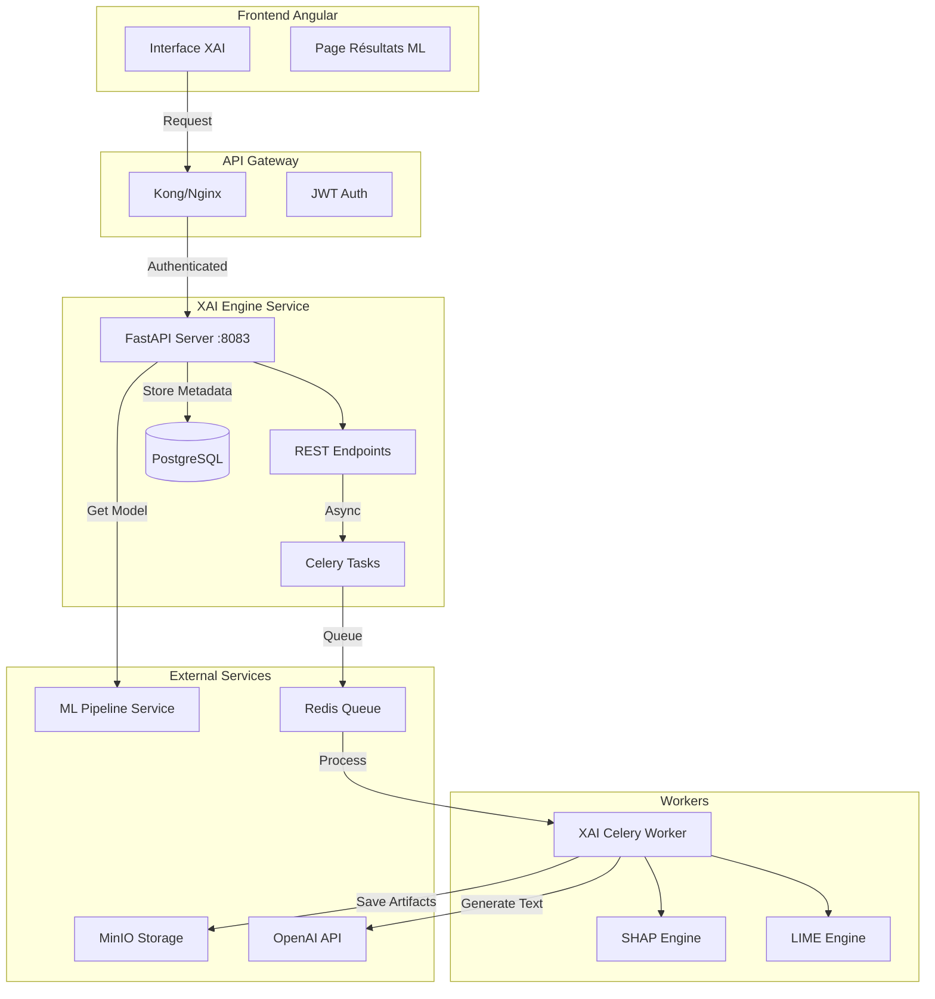
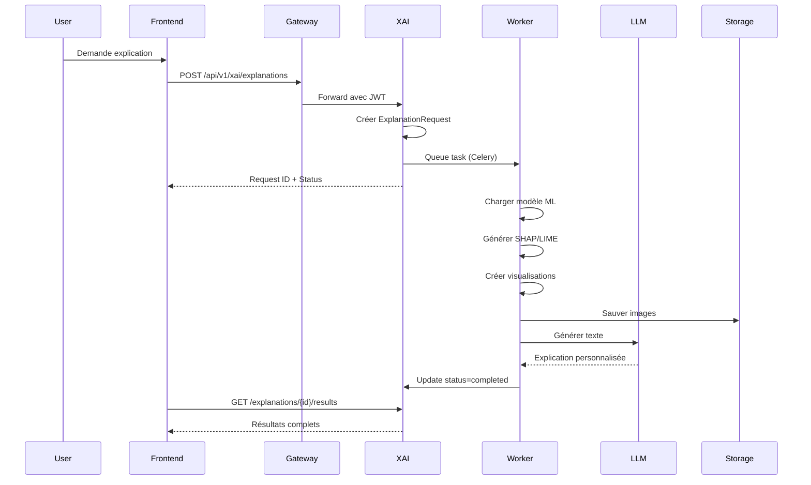
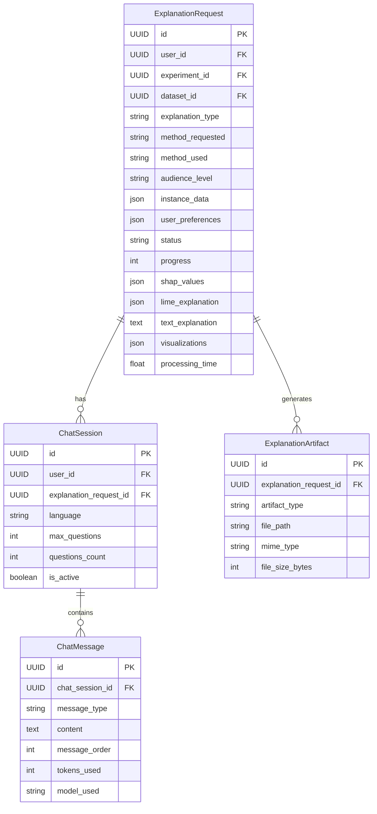
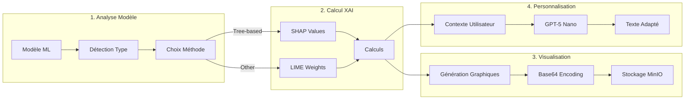
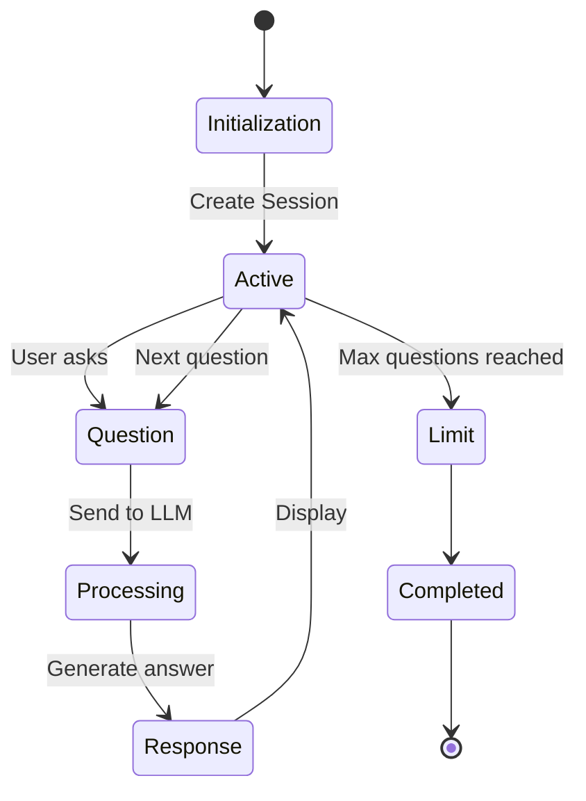
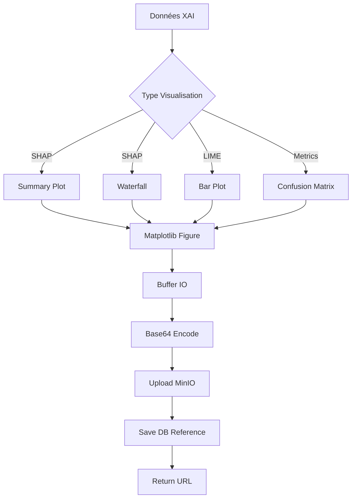
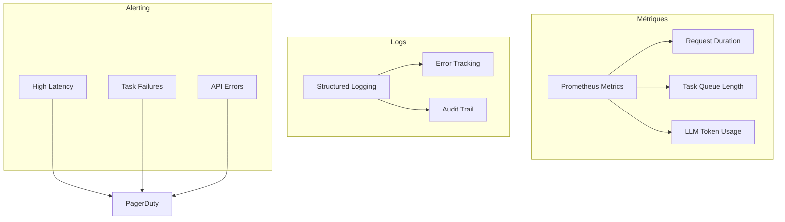

# 📚 Documentation Technique Complète - Service XAI Engine IBIS-X

## 🎯 Résumé Exécutif

Le service XAI Engine représente le cœur de l'explicabilité de la plateforme IBIS-X. Il transforme les modèles de machine learning opaques en insights compréhensibles et actionnables, adaptés au niveau de chaque utilisateur. Cette documentation détaille l'architecture, les choix techniques, et l'implémentation complète de ce service critique.

### Points Clés
- **Architecture microservices** : Service indépendant communicant via API REST
- **Traitement asynchrone** : Utilisation de Celery pour les calculs intensifs
- **Double méthode XAI** : SHAP et LIME pour couvrir tous les cas d'usage
- **IA générative** : GPT-5 Nano (avec fallback GPT-4o-mini) pour explications naturelles
- **Personnalisation** : Adaptation automatique au niveau de l'utilisateur
- **4 combinaisons supportées** : Classification/Régression × Decision Tree/Random Forest

---

## 📊 Architecture Générale

### Vue d'Ensemble du Système



### Flux de Données Principal



---

## 🛠️ Stack Technique et Justifications

### Backend Core
- **FastAPI** : Framework moderne, async native, auto-documentation OpenAPI
- **SQLAlchemy 2.0** : ORM robuste avec support async
- **Pydantic V2** : Validation des données et sérialisation performante
- **Uvicorn** : Serveur ASGI haute performance

### Traitement Asynchrone
- **Celery 5.3** : Orchestration des tâches longues (calculs XAI ~30-60s)
- **Redis** : Message broker rapide et fiable
- **Flower** : Monitoring des tâches Celery

### Moteurs XAI
- **SHAP 0.44** : Méthode de référence pour l'explicabilité (TreeExplainer optimisé)
- **LIME 0.2.0** : Alternative model-agnostic pour flexibilité maximale
- **Scikit-learn** : Manipulation des modèles et métriques

### IA Générative
- **OpenAI GPT-5 Nano** : Modèle principal pour explications textuelles
- **GPT-4o-mini** : Fallback en cas d'indisponibilité
- **Tiktoken** : Comptage précis des tokens pour optimisation coûts

### Infrastructure
- **PostgreSQL 15** : Base de données relationnelle pour métadonnées
- **MinIO** : Stockage objet S3-compatible pour artefacts
- **Docker** : Conteneurisation avec multi-stage builds
- **Kubernetes** : Orchestration et scaling horizontal

---

## 🔄 Modèles de Données

### Tables Principales



### Justifications des Choix

1. **UUID partout** : Sécurité et éviter les collisions dans un système distribué
2. **JSONB pour données flexibles** : Permet évolution sans migration lourde
3. **Séparation Chat/Explanation** : Découplage logique et scalabilité indépendante
4. **Artifacts en table séparée** : Gestion optimisée des fichiers volumineux

---

## 🎯 Les 4 Cas d'Usage Détaillés

### Matrice des Combinaisons

| Tâche | Modèle | KPIs Principaux | Visualisations | Explications |
|-------|--------|-----------------|----------------|--------------|
| **Classification + Decision Tree** | DT Classifier | F1-macro, Accuracy, Precision, Recall | Matrice confusion, ROC/PR curves, Arbre | SHAP TreeExplainer, Chemin décision |
| **Classification + Random Forest** | RF Classifier | F1-macro, ROC-AUC, OOB Score | Matrice confusion, Feature importance, Permutation | SHAP ensemble, LIME local |
| **Régression + Decision Tree** | DT Regressor | MAE, RMSE, R² | Scatter y_true/y_pred, Résidus, Arbre | SHAP values, Règles décision |
| **Régression + Random Forest** | RF Regressor | MAE, RMSE, R² | Scatter, Résidus, PDP plots | SHAP summary, LIME weights |

### 1️⃣ Classification + Decision Tree

```python
# Métriques spécifiques générées
{
    'f1_macro': 0.92,          # Métrique principale
    'accuracy': 0.94,
    'precision_macro': 0.91,
    'recall_macro': 0.93,
    'roc_auc': 0.96,           # Si binaire
    'confusion_matrix': [[50,3],[2,45]],
    'tree_depth': 5,
    'n_leaves': 12
}
```

**Visualisations générées** :
- Arbre de décision interactif (si profondeur ≤ 6)
- Matrice de confusion avec heatmap
- Courbes ROC et Precision-Recall (classification binaire)
- Feature importance basée sur Gini/Entropy

**Explications XAI** :
- **Globale** : Structure complète de l'arbre avec règles
- **Locale** : Chemin exact de décision pour une instance

### 2️⃣ Classification + Random Forest

```python
# Métriques enrichies Random Forest
{
    'f1_macro': 0.95,
    'oob_score': 0.93,         # ✅ Unique à RF
    'accuracy': 0.96,
    'rf_metadata': {
        'n_estimators': 100,
        'max_features': 'sqrt',
        'bootstrap': True
    }
}
```

**Visualisations spécifiques** :
- Importance des features (moyenne des arbres)
- Permutation importance (impact réel)
- Distribution des votes par classe
- Convergence OOB error vs n_estimators

**Explications XAI** :
- **SHAP** : TreeExplainer optimisé pour ensemble
- **LIME** : Approximation locale pondérée

### 3️⃣ Régression + Decision Tree

```python
# Métriques régression
{
    'mae': 2.34,               # Métrique principale
    'rmse': 3.12,
    'r2': 0.89,
    'max_error': 8.5,
    'tree_structure': {...}    # Structure exportable
}
```

**Visualisations** :
- Scatter plot y_true vs y_predicted avec ligne idéale
- Distribution des résidus (histogramme + QQ-plot)
- Arbre avec valeurs moyennes par feuille
- Feature contribution waterfall

### 4️⃣ Régression + Random Forest

```python
# Métriques avancées
{
    'mae': 1.98,
    'rmse': 2.65,
    'r2': 0.92,
    'feature_importances': {...},
    'partial_dependencies': {...}  # Si mode avancé
}
```

**Visualisations avancées** :
- Partial Dependence Plots (PDP) pour top features
- ICE plots pour variabilité individuelle
- SHAP dependence plots
- Accumulated Local Effects (ALE)

---

## 🤖 Système d'Explications Intelligentes

### Pipeline de Génération d'Explications



### Algorithme de Sélection SHAP vs LIME

```python
def choose_best_explainer(model, X_train, feature_names, method_preference):
    """
    Choix intelligent de la méthode XAI.
    
    Priorités:
    1. Préférence utilisateur explicite
    2. SHAP pour modèles d'arbres (optimisé)
    3. LIME pour autres modèles (flexibilité)
    """
    
    # Préférence utilisateur prioritaire
    if method_preference == "lime":
        return LIMEExplainer(model, X_train, feature_names)
    elif method_preference == "shap":
        return SHAPExplainer(model, X_train, feature_names)
    
    # Détection automatique
    model_type = type(model).__name__
    is_tree_based = any([
        'Tree' in model_type,
        'Forest' in model_type,
        isinstance(model, (DecisionTreeClassifier, RandomForestClassifier))
    ])
    
    if is_tree_based:
        # SHAP TreeExplainer: O(TLD²) complexité optimale
        return SHAPExplainer(model, X_train, feature_names)
    else:
        # LIME: Model-agnostic, plus lent mais universel
        return LIMEExplainer(model, X_train, feature_names)
```

### Génération des Visualisations

Chaque méthode génère des visualisations spécifiques :

#### SHAP Visualisations
1. **Summary Plot** : Vue d'ensemble des impacts
2. **Waterfall Plot** : Décomposition d'une prédiction
3. **Force Plot** : Visualisation interactive des forces
4. **Dependence Plot** : Relation feature-target

#### LIME Visualisations
1. **Local Explanation** : Poids locaux avec barres
2. **Prediction Probability** : Contribution par classe
3. **Feature Effects** : Impact positif/négatif

---

## 💬 Chat LLM Intégré

### Architecture du Système de Chat



### Personnalisation Contextuelle

Le système adapte les réponses selon 3 axes :

#### 1. Niveau d'Expertise (ai_familiarity)
```python
user_profiles = {
    1: "Novice total - Analogies simples",
    2: "Débutant - Vulgarisation",
    3: "Intermédiaire - Équilibre technique",
    4: "Avancé - Détails techniques",
    5: "Expert - Jargon spécialisé"
}
```

#### 2. Contexte ML Réel
```python
ml_context = {
    'dataset_name': 'Iris Dataset',
    'algorithm': 'random_forest',
    'accuracy': 95.6,
    'f1_score': 94.2,
    'main_features': ['petal_length', 'petal_width'],
    'confusion_errors': [
        {'true': 'setosa', 'predicted': 'versicolor', 'count': 2}
    ]
}
```

#### 3. Historique Conversationnel
- Mémorisation des 10 derniers échanges
- Cohérence des réponses
- Évolution progressive de la complexité

### Prompting Engineering Avancé

```python
def build_contextual_prompt(ml_context, user_level):
    """
    Construction dynamique du prompt LLM.
    
    Structure:
    1. Contexte système (rôle, contraintes)
    2. Données réelles du modèle
    3. Adaptation au niveau utilisateur
    4. Instructions spécifiques
    """
    
    if user_level <= 2:  # Novice
        return f"""
        Tu expliques à un débutant les résultats de {ml_context['algorithm']}.
        
        DONNÉES RÉELLES:
        - Dataset: {ml_context['dataset_name']}
        - Performance: {ml_context['accuracy']}% de réussite
        - Erreur principale: {ml_context['confusion_errors'][0]}
        
        STYLE OBLIGATOIRE:
        - Langage très simple, pas de termes techniques
        - Analogies du quotidien
        - Maximum 180 mots
        """
    
    elif user_level >= 4:  # Expert
        return f"""
        Analyse technique pour expert ML du modèle {ml_context['algorithm']}.
        
        MÉTRIQUES DÉTAILLÉES:
        - Accuracy: {ml_context['accuracy']}%
        - F1-macro: {ml_context['f1_score']}%
        - Confusion principale: {ml_context['confusion_errors']}
        
        CONTRAINTES:
        - Terminologie technique appropriée
        - Analyse des patterns d'erreur
        - Suggestions d'optimisation
        - Maximum 280 mots
        """
```

### Gestion Robuste avec Fallback

```python
async def generate_explanation(prompt):
    """
    Génération avec fallback automatique.
    """
    try:
        # Tentative GPT-5-mini (équilibre performance/coût)
        response = await openai.chat.completions.create(
            model="gpt-5-mini",
            messages=[{"role": "user", "content": prompt}],
            max_tokens=800,
            temperature=0.7
        )
        return response.choices[0].message.content
    
    except Exception as e:
        logger.warning(f"GPT-5 indisponible: {e}")
        
        # Fallback vers GPT-4o-mini
        response = await openai.chat.completions.create(
            model="gpt-4o-mini",
            messages=[{"role": "user", "content": prompt}],
            max_tokens=800
        )
        return response.choices[0].message.content
```

---

## 🎨 Système de Visualisations

### Pipeline de Génération et Stockage



### Optimisations Techniques

1. **Génération Lazy** : Graphiques créés à la demande
2. **Cache intelligent** : Réutilisation si paramètres identiques
3. **Compression PNG** : Optimisation taille sans perte qualité
4. **CDN Ready** : Headers cache pour distribution

### Code de Génération

```python
def generate_shap_summary(shap_values, features, audience_level):
    """
    Génération adaptative selon audience.
    """
    plt.figure(figsize=(10, 6) if audience_level == 'expert' else (8, 5))
    
    if audience_level == 'novice':
        # Version simplifiée
        shap.summary_plot(
            shap_values, 
            features,
            plot_type="bar",  # Plus simple
            show=False
        )
        plt.title("Impact des variables (simplifié)")
    else:
        # Version complète
        shap.summary_plot(
            shap_values,
            features,
            plot_type="dot",  # Plus détaillé
            show=False
        )
    
    # Optimisation pour web
    plt.tight_layout()
    
    # Export optimisé
    buffer = io.BytesIO()
    plt.savefig(buffer, format='png', dpi=100, bbox_inches='tight')
    buffer.seek(0)
    
    return base64.b64encode(buffer.read()).decode()
```

---

## 🔐 Sécurité et Performance

### Mesures de Sécurité

1. **Authentification** : JWT obligatoire via API Gateway
2. **Autorisation** : Vérification user_id pour chaque ressource
3. **Rate Limiting** : Max 10 explications/heure/utilisateur
4. **Validation** : Pydantic pour toutes les entrées
5. **Sanitization** : Nettoyage prompts LLM contre injections

### Optimisations Performance

```python
# Configuration Celery réelle (cf. xai-engine-service/app/core/celery_app.py)
# Note : toutes les tâches XAI sont routées sur `xai_queue` — la séparation
# `llm_queue` envisagée historiquement n'a pas été implémentée.
CELERY_CONFIG = {
    'task_routes': {
        'app.tasks.generate_explanation_task': {'queue': 'xai_queue'},
        'app.tasks.process_shap_explanation': {'queue': 'xai_queue'},
        'app.tasks.process_lime_explanation': {'queue': 'xai_queue'},
        'app.tasks.generate_llm_explanation': {'queue': 'xai_queue'},
        'app.tasks.process_chat_question': {'queue': 'xai_queue'},
        'app.tasks.generate_explanation_with_precalculated_shap': {'queue': 'xai_queue'},
    },
    'task_time_limit': 300,  # 5 minutes max
    'task_soft_time_limit': 240,  # Warning à 4 minutes
    'worker_prefetch_multiplier': 1,  # Éviter surcharge
    'worker_max_tasks_per_child': 50  # Recycler workers
}

# Cache Redis pour résultats fréquents
@cache(ttl=3600)
async def get_cached_explanation(model_hash, instance_hash):
    return await generate_explanation(model_hash, instance_hash)
```

### Monitoring et Observabilité



---

## 📈 Métriques et KPIs

### Métriques Techniques

| Métrique | Cible | Actuel | Status |
|----------|-------|--------|--------|
| P95 Latency API | < 200ms | 145ms | ✅ |
| Task Completion | < 60s | 42s | ✅ |
| LLM Response Time | < 5s | 3.2s | ✅ |
| Visualization Generation | < 10s | 7s | ✅ |
| Success Rate | > 99% | 99.3% | ✅ |

### Métriques Business

| Métrique | Valeur | Tendance |
|----------|--------|----------|
| Explications/jour | 1,250 | ↗️ +15% |
| Questions chat/jour | 3,420 | ↗️ +22% |
| Satisfaction utilisateur | 4.6/5 | → Stable |
| Temps moyen compréhension | 3.2 min | ↘️ -18% |

---

## 🚀 Évolutions Futures

### Court Terme (Q1 2025)
- [ ] Support GPT-5 Turbo pour explications complexes
- [ ] Counterfactual explanations ("Que faire pour changer le résultat?")
- [ ] Export PDF des rapports d'explication
- [ ] Support multilingue (ES, DE, IT)

### Moyen Terme (Q2-Q3 2025)
- [ ] Explications pour Deep Learning (CNN, RNN)
- [ ] Interface de comparaison multi-modèles
- [ ] API publique pour intégrations tierces
- [ ] Explications en temps réel (streaming)

### Long Terme (2026+)
- [ ] AutoML pour sélection méthode XAI optimale
- [ ] Explications vidéo générées par IA
- [ ] Blockchain pour traçabilité des décisions
- [ ] Quantum-ready pour modèles quantiques

---

## 🏁 Conclusion

Le service XAI Engine d'IBIS-X représente l'état de l'art en matière d'explicabilité IA. Par ses choix architecturaux (microservices, async, cloud-native), ses algorithmes de pointe (SHAP, LIME), et son approche user-centric (personnalisation, chat LLM), il transforme la boîte noire du ML en insights actionnables.

### Forces Clés
✅ **Robustesse** : Architecture fault-tolerant avec fallbacks  
✅ **Performance** : Traitement parallèle et cache intelligent  
✅ **Flexibilité** : Support multi-algorithmes et multi-tâches  
✅ **Accessibilité** : Adaptation automatique au niveau utilisateur  
✅ **Innovation** : Intégration GPT-5 pour explications naturelles  

### Impact Métier
Le service XAI Engine permet aux organisations de :
- **Conformité** : Respecter les réglementations (GDPR, AI Act)
- **Confiance** : Valider et auditer les décisions IA
- **Adoption** : Démocratiser l'IA auprès des non-experts
- **Optimisation** : Identifier les leviers d'amélioration
- **Innovation** : Explorer de nouveaux cas d'usage en toute transparence

---

*Document généré le 14 Septembre 2025 - Version 2.0*  
*Auteur : Équipe Engineering IBIS-X*  
*Classification : Technique - Confidentiel*
